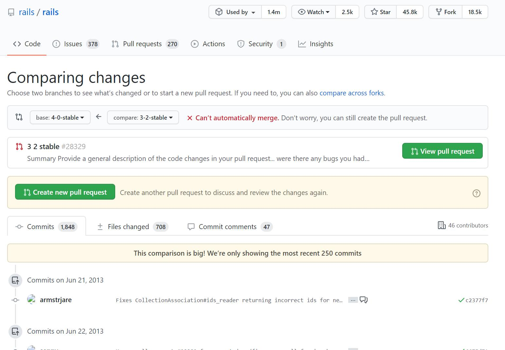

# 仓库

这个页面可以说是各个软件的大门。循着目录找下去我们就可以查阅自己想要的文件。如果有相应权限，还可以对文件的内容直接进行编辑、提交。

## 文件的相关操作

点开文件后会显示出文件的内容，同时右上角会显示用于该文件的菜单（图5.1）。Edit可以对文件内容进行编辑并提交。Raw可以直接在浏览器中显示该文件的内容。使用这个URL，就能通过HTTPS协议获取该文件。Blame能够按行显示最新提交的信息。History可以查看该文件的历史记录。Delete可以删除这个文件。

文件内容的左侧会显示该文件的行号。假如我们点击第10行的行号，这一行就会被高亮标记为黄色，同时URL末尾会自动添加“#L10”。使用这个URL，程序员们在交流时，就可以将讨论明确指向某一行。另外，如果将“#L10”改成“#L10-15”，则会标记该文件的第10～15行。各位不妨将这点记下来，以便日后应用。

## 通过部分名称搜索文件

各位不妨在仓库页面试着按下键盘的t键，然后输入要找的目录或文件的部分名称。筛选器会在仓库的目录和文件中进行筛选，搜索出您要找的文件（图a）。

这种方式要比一级级查看目录和文件快得多，请积极利用。

## 查看差别

在GitHub上，直接修改URL就可以让用户以多种形式查看差别。这里我们以Ruby on Rails的仓库为例，给各位介绍直接修改URL的一些技巧。

### 查看分支间的差别

比如我们想查看4-0-stable分支与3-2-stable分支之间的差别，可以像下面这样将分支名加到URL里。

[https://github.com/rails/rails/compare/4-0-stable...3-2-stable](https://github.com/rails/rails/compare/4-0-stable...3-2-stable)

这样，就可以查看两个分支间的差别了（图5.2）。可以看到，有65名程序员经过1710次提交，完成了3.2版本到4.0版本的升级工作。

